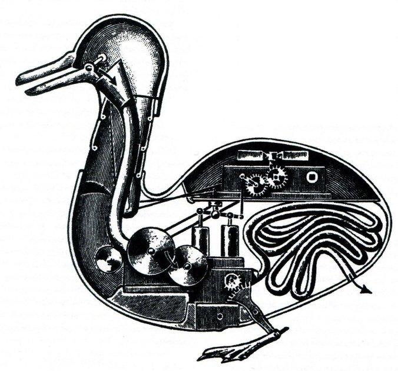
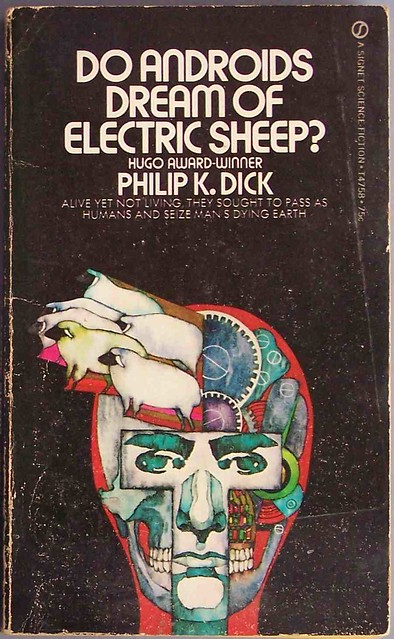

## Do androids dream of electric duck?



---


Note: Welcome to my session,
has anybody ever watched Blade runner or read "Do androids dream of electric sheep?"
please raise your hands.
Well for those who have not, let me tell you a spoiler-free introduction.
---
<!-- .slide: data-background="./imgs/andy-kelly-402111-unsplash.jpg" -->
Note: Set in a dystopian future, most of human beings have left Earth for other planets. They managed the hardness of these unhospitable colonies with the help of humanoid replicants.
The main character is a bounty hunter whose mission is to find and "retire" renegade androids.
---
Note: Androids development is now so advanced that the latest Nexus model is indistinguishable from authentic human beings. Some of them feature memory implant and are not aware of being synthetic humanoids. To tell if someone is an android, they have to pass the Voight-Kampff empathy test with questions such as:

"You're watching TV. Suddenly you realise there's a wasp crawling on your arm. You..."

But even this test is not 100% reliable anymore.
---
Note: It is a commonplace to say that the work of Philip K. Dick is centrally concerned with the question of what is real.
"Do androids dream of electric sheep" looks at a particular branch of this question. What is fake ?
And if you can make a fake seems to be authentic enough, does it matter ?
---
Note: Reading the book I realised that as engineers we have our own Voight-Kampff tests.
We use it to determine what a piece of data is.
We are not really concerned about authenticity but we want to know if a piece of data respects an interface: if it has a specific set of attributes and methods.
This is about separating data and process.
And data needs to be fit for a the process:
---
```js
function getTotal(items) {
  let total = 0
  for (let i = 0; i < items.length; i++) {
    total += items[i].getPrice()
  }
  return total
}
```
Note: In the previous example I don't care if "items" is an array. But I should be able to use indeces on it.
Also I don't care what objects contains, as soon as they have a "getPrice" method that returns what I expect.

We call this property polymorphism.

polymorphism is a very powerful mechanism we can leverage to generalise algorithms that work across different type of objects. We use it a lot in testing. Stubs Mocks and spies are fake objects, just real enough to pass the test.

Polymorphism, comes with different flavours.
In classical OOP different objects are based on one or more interfaces.
Every interface constitutes a contract: a promise to support a set of methods and attributes.

---

```js
function do(maybeDuck) {
  if (maybeDuck.walks && maybeDuck.quacks) {
    maybeDuck.walks();
    maybeDuck.quacks('I am a duck!');
    return;
  }
  // not a duck, doing something else of throw an error
}
```
Note: In dynamic languages (such as Python and Javascript), duck typing instead is widely used.

"If it walks like a duck and it quacks like a duck, then it must be a duck"

That translates in:
---
As we are not obsessed on hunting android ducks, we are happy if our duck is an android one.
For us is just as good as a real one.

Now think about the concept of sequence. Can you guess what type is this sequence?
```js
for (let i = 0; i < sequence.length; i++) {
  run(sequence[i])
}
```
Yes! it can be either a string or an array. But this is somewhat limiting.

Think about this:
```js
for (let i = 0; i < 10; i++) {
  run(i)
}
```
This piece of code returns a sequence of numbers from 0 to 9
This sequence can't be expressed by an array (although it can be saved in one).
We are not interested in accessing items of the sequence, in this case we are interested of the different values that "i" has over time

We are also not interested about its length. A sequence can be infinite:
```js
let i = 0
while (true) {
  run(i++)
}
```

And of course storing an infinite sequence in an array is both unfeasible and meaningless.

ES2015 provides a way to abstract away the concept of sequence. It's called "iterable".

It allows to iterate over a sequence of numbers:
```js
function * countTo (max = Infinity) {
  let i = 0
  while (i < max) {
    yield i++
  }
}

for (const item of countTo(10)) {
  run(item)
}
```
But also works with arrays, strings:
```js
for (const item of [0, 10, 13, 5, 4]) {
  run(item)
}

for (const item of 'iterable') {
  run(item)
}
```

Let's recap iterables advantage:
- you don't need to store a sequence in memory. They can be used to work on enormous amount of data.
- In some case are faster than array, because they don't allocate memory for new arrays when mapping/filtering
- they are part of the js api: Promise.all takes an iterable, spread operator takes an iterable, for .. of, Map/Set constructor takes iterables, and return iterables (keys, values methods).
- readable and elegant

There are also some disadvantage:
- some operation, that rely on having the data in memory is awkward: sorting, shuffling for example
- direct access using an index is not allowed

ES2018 gives us a way to abstract asynchronous sequences too. It is called asyncIterables.
They can be used for example with files and network resources.
```js
const stream = fs.createReadStream(filepath, { encoding: 'utf8' })
for await (const item of stream) {
  run(item)
}
```
From node 10, every stream is asyncIterable.

Compare this to:
```js
const stream = fs.createReadStream(filepath, {
  encoding: 'utf8'
});
stream.on('data', run);
```
Event based stream can be a bit "messy".
asyncIterable is clearer.

Now we talked about the advantages of polymorphism and how this makes working with sequences easy and readable.
Let's take a closer look at iterables and asyncIterables. How do they work in detail?


The basic building blocks are the iterator/asyncIterator and iterable/asyncIterable interfaces. Let's start with the first.

An iterator is an object that implement a function next. And this function returns an object with this shape:
```js
{ value: 'the value returned', done: false }

{ done: true } // this signals that the sequence is exhausted
```
asyncIterators are similar but their next method returns a Promise that once resolved returns the same kind of objects.

Both iterator/asyncIterator can implement optional methods such as throw/return. We will have a look at return in a few paragraphs.

Here's an example:
```js
const iterator = {
  c: 0,
  next () {
    if (this.c === 3) return { done: true }
    return { value: this.c++, done: false }
  }
}
```
for convenience we can build a function that return an iterator (so that we can reuse it multiple times):
```js
const getIterator = () => ({
  c: 0,
  next () {
    if (this.c === 3) return { done: true }
    return { value: this.c++, done: false }
  }
})
```
and we can use it in this way:
```js
function log (iterat) {
  while (true) {
    const { value, done } = iterat.next()
    if (done) break
    console.log(value)
  }
}

log(getIterator())
```
and here is an example with an asyncIterator:
```js
const getAsyncIterator = () => ({
  c: 0,
  async next () {
    if (this.c === 3) return { done: true }
    return { value: this.c++, done: false }
  }
})

async function log (iterat) {
  while (true) {
    const { value, done } = await iterat.next()
    if (done) break
    console.log(value)
  }
}

log(getAsyncIterator())
```

This pattern of generating a new iterator is very useful and it is part of the iterable/asyncIterable interface.

We can define as iterable an object that has a method named "Symbol.iterator" and this method returns an iterator.

```js
const iterable = {
  [Symbol.iterator]: getIterator
}
```
We can use this object like this:
```js
function log (iterab) {
  const iterat = iterable[Symbol.iterator]()
  while (true) {
    const { value, done } = iterat.next()
    if (done) break
    console.log(value)
  }
}

log(iterable)
```

But ES2015 gives us more convenient ways to consume an iterable.
```js
for (const value of iterable) {
  console.log(value)
}
```
Another way to consume iterables is using the spreap operator:
```js
const [a, b] = iterable // only interested in the first 2 values
```
and of course, getting an array:
```js
const arr = Array.from(iterable)
// or
const arr2 = [...iterable]
```
All of this can also be used by regular strings and arrays because they ARE iterables.
```js
const arr = [1, 2, 3]
const str = 'hello'
Symbol.iterator in arr // true
Symbol.iterator in str // true
```

We can define as async iterable, an object that has a method named "Symbol.asyncIterator" and this method returns an async iterator.

```js
const asyncIterable = {
  [Symbol.asyncIterator]: getAsyncIterator
}
```
This can be consumed like this:
```js
async function log (asyncIterab) {
  const iterat = asyncIterab[Symbol.asyncIterator]()
  while (true) {
    const { value, done } = await iterat.next()
    if (done) break
    console.log(value)
  }
}

log(asyncIterable)
```
Or more simply:
```js
for await (const value of asyncIterable) {
  console.log(value)
}
```
Pop quiz: how can you detect if an object provides the iterator or iterable interface ?
Have you noticed how we are using duck typing polymorphism for these 2 interfaces ?


* iterators
* iterables
* return
* function generator
* reimplement function generator
Native iterables, native methods
* reiMplement for loop

* asyncIterators
* asyncIterables

Native asyncIterables
